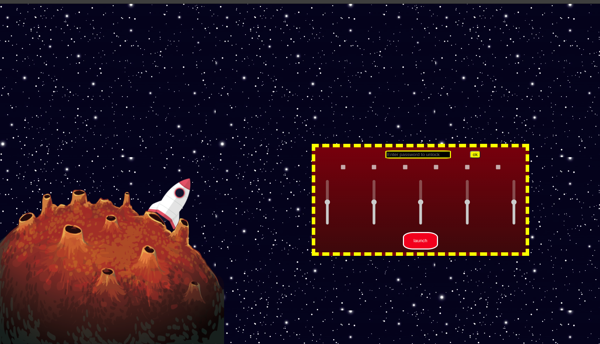

# OpenSpace App

## Table of Contents
* [General Info](#general-information)
* [Technologies Used](#technologies-used)
* [Features](#features)
* [Screenshots](#screenshots)
* [Setup](#setup)
<!-- * [Usage](#usage) -->
* [Project Status](#project-status)
<!-- * [Room for Improvement](#room-for-improvement) -->
* [Acknowledgements](#acknowledgements)
* [Contact](#contact)

## General Information
- Simple 'game' in JS 

## Technologies Used
- HTML
- JavaScript
 
## Features
List the ready features here:
- After typing password, checking all checkboxes and pulling levers to 100 you can launch rocket

## Screenshots
 
 
## Setup
To run this project copy repository and open index.html
Password to launch rocket: 'TrustNo1'

## Project Status
Project is: __in_progress__ 

## Acknowledgements
- This project was part of JetBrains Academy - Frontend Developer track.

## Contact
Created by Karol Kijowski
